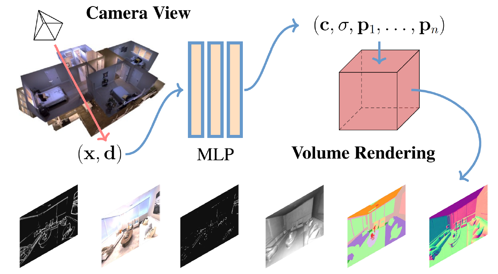

> # [WACV 2023] Beyond RGB: Scene-Property Synthesis with Neural Radiance Fields <br>
> [Paper](https://arxiv.org/abs/2206.04669)

This repository contains a PyTorch implementation of our paper "Beyond RGB: Scene-Property Synthesis with Neural Radiance Fields".



## Installation

#### Tested on a single NVIDIA GeForce RTX 1080 / 2080 GPUs with 11GB memory.

To install the dependencies, run:

```
pip install -r requirements.txt
```

## Data Preparation
First organize the data of the scene in the hierarchy shown below (e.g., there are 50 frames in this scene):

```
datadir
  - images
     - 000.png
     - 001.png
...
     - 049.png
  - normal
     - 000.png
     - 001.png
...
     - 049.png
  - reshading
     - 000.png
     - 001.png
...
     - 049.png
  - label
     - 000.png
     - 001.png
...
     - 049.png
  - keypoint
     - 000.png
     - 001.png
...
     - 049.png
  - edge
     - 000.png
     - 001.png
...
     - 049.png
  - poses_bounds.npy
```

`datadir` is the name of the direction of the scene, which is specified in the configuration file. `poses_bounds.npy` consists of the poses of all the frames in the feed-forward style scene,
which can be constructed using the guidance in https://github.com/Fyusion/LLFF#using-your-own-poses-without-running-colmap.

## Training (Optimizing on a specific scene)

Run the command:

```
python run_nerf.py --config configs/repaired.txt --no_ndc
```

Tips: If you are running the code using a device which only has approximately 11GB memory (e.g., GeForce RTX 1080 / 2080 GPUs),
we recommend that you could set the argument `i_testset` to 200000 (the total number of iterations), to avoid interruption during training due to limited GPU memory.

Remember to turn on the flag `--no_ndc` as it will be a more proper setting for feed-forwarding scenes.

The default training/testing split is the seven views {0, 8, 16, 24, 32, 40, 48} are the hold-out testing views
and the rest are training views for optimization process. You could customize your own training/testing split on [L651](https://github.com/zsh2000/SS-NeRF/blob/856a3b3d12698a710b2b7a6805d878109a7cc692/run_nerf.py#L651) in run_nerf.py.


## Testing (Novel view synthesis)

When using a larger GPU which is capable of rendering novel view results during training, there is no need for separate testing command.

If you are using the device with small GPU memory as mentioned above in the "tips", you could perform novel view synthesis by
running an additional command, which is the same as training command:

```
python run_nerf.py --config configs/repaired.txt --no_ndc
```

## Citation
If you find our work useful, please consider citing:
```BibTeX
@inproceedings{ssnerf-2023,
  author = {Zhang, Mingtong and Zheng, Shuhong and Bao, Zhipeng and Hebert, Martial and Wang, Yu-Xiong},
  title = {Beyond RGB: Scene-Property Synthesis with Neural Radiance Fields},
  booktitle = {IEEE/CVF Winter Conference on Applications of Computer Vision (WACV)},
  year = {2023}
}
```

### Acknowledgement
The codes are largely borrowed from the PyTorch implementation of NeRF:

https://github.com/yenchenlin/nerf-pytorch

This work was supported in part by NSF Grant, Toyota Research Institute, NIFA award, the Jump ARCHES endowment through the Health Care
Engineering Systems Center, the National Center for Supercomputing Applications (NCSA) at the University of Illinois
at Urbana-Champaign through the NCSA Fellows program,
and the IBM-Illinois Discovery Accelerator Institute.
